# Analyzing Win Probabilities in the Dice Game "Liar's Dice" Using Monte Carlo Simulations
## Project Overview
This project simulates and analyzes the dice game Liar's Dice using Monte Carlo simulations. The primary objective is to explore how different player strategies and rule changes impact gameplay outcomes. Additionally, the project aims to validate the fairness and randomness of the game mechanics.
Project Type: Type II - Original Monte Carlo Analysis 

## Team Members:
Yueyue Lin, GitHub: https://github.com/Yena830
Jiajing Liang, GitHub: https://github.com/Fiona729

## How to run
Clone this repository.
Run the notebook.

## Game Overview
Players bid on dice outcomes, considering both quantity and face value.
Players may challenge the previous bid by calling "Liar!" The game dynamics depend on the validity of the challenge.
Special rules:
"1" acts as a wildcard, contributing to any face value.
The player who loses the challenge is penalized (e.g., by losing a die).

Code Design
The project is structured into modular Python scripts to enable flexibility and scalability. The key components include:

1. Game Engine: game_play_rule.py
Implements core gameplay mechanics such as:
roll_dice(): Simulates dice rolling.
valid_challenge(): Checks if a "Liar" call is valid.
update_all_dice(): Updates dice counts after each round.
simulate_game(): Executes the entire game loop.
2. Player Strategies: game_strategies.py
Defines strategies used by players during simulations:
random_bid(): Generates random bids.
inform_bid(): Prioritizes bids based on preferred dice.
make_action(): Decides whether to bid or call "Liar" based on thresholds.
3. Validation Tools: validation_setting.py
Evaluates the fairness and correctness of the gameplay:
Win rate analysis.
Validation of dice randomness.
Heatmaps and data visualizations.
4. Experiments and Visualizations: Jupyter Notebook
Integrates the core modules for hypothesis testing and result visualization.

## Hypotheses
The project tests several hypotheses related to gameplay dynamics and strategies:

1. First Caller Advantage: The first player has a higher win rate due to their ability to set the initial bid.
2. Preferred Dice Bid: Players bidding based on their most frequent dice achieve higher win rates.
3. Threshold for Calling "Liar": Players using optimized thresholds for challenges outperform those using random strategies.
4. Optimal Strategy Combination: Combining threshold-based and preferred dice bidding yields the best outcomes.
5. Special Rule Impact: Modifications to the rules (e.g., reducing one die instead of eliminating a player) affect fairness and strategy effectiveness.

## Random Variables
1. Dice Rolls: Dice fave value and the number of fave value
2. Player Order: Who is the first caller and the player order in each round.
3. Challenge choices: Whether choose bid or challenge
4. The bid that player will give : [quantity, face value]

## Validation
To ensure the robustness of the simulations, the following validations were conducted:

1. Dice Distribution: Verified that dice rolls follow a uniform distribution.
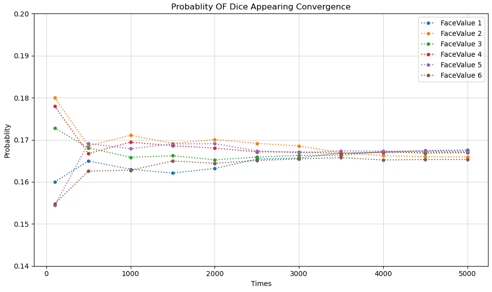
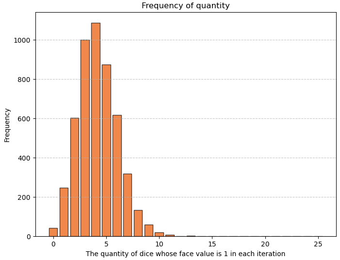
2. Challenge Distribution: Confirmed players' challenge behavior aligns with expectations under random strategies.
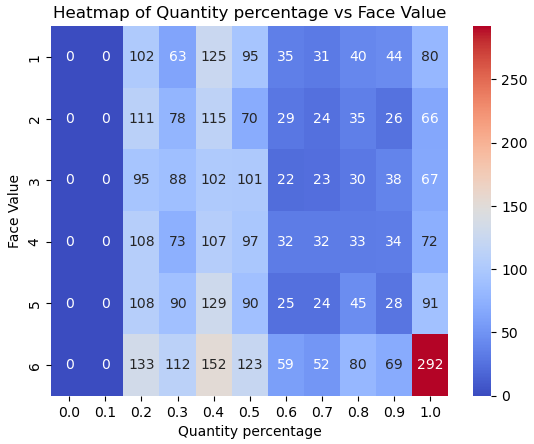
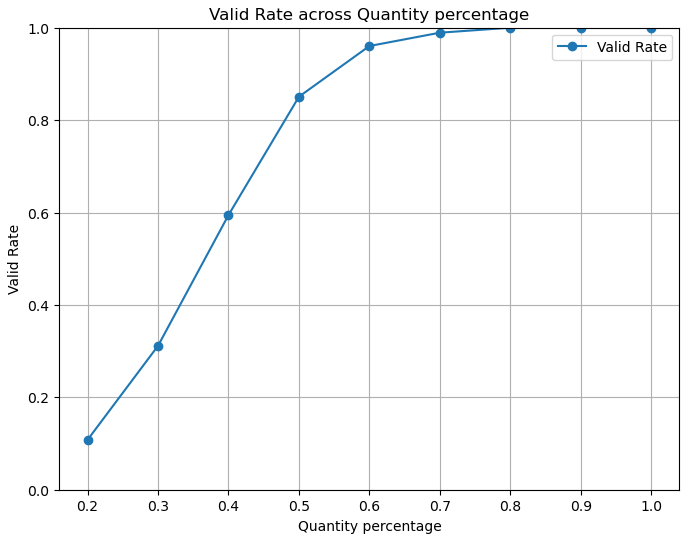
3. Random Strategy Outcomes: Demonstrated uniform win rates across players when no strategy is applied.
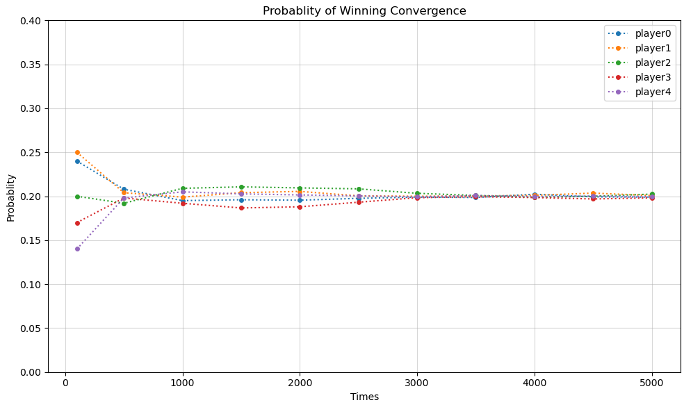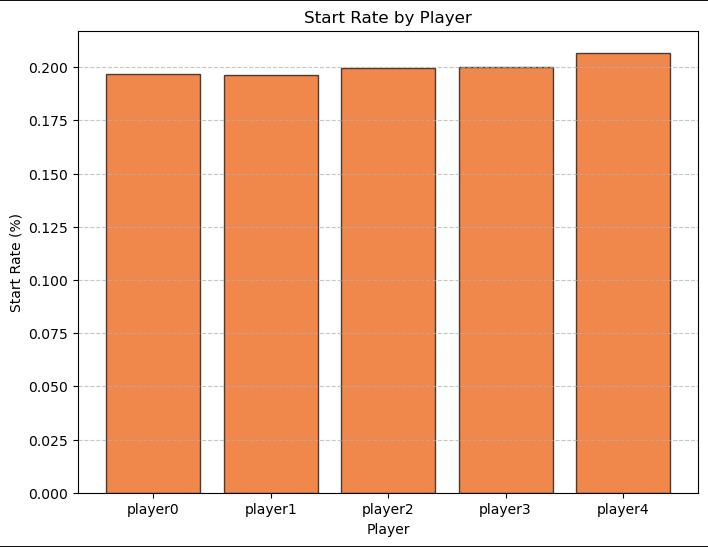 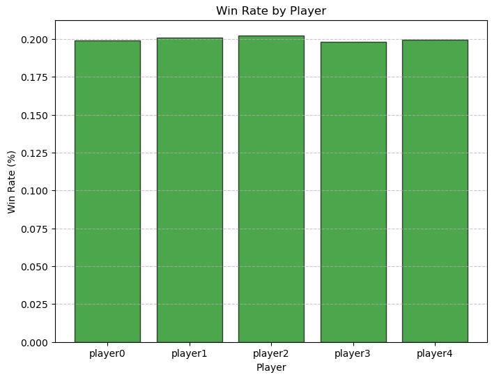

## Experiments
### 1. First Caller Advantage
We set player0 to be the first caller in all games.
Expected result: The player chooses to bid first(player0) would have a higher win rate than other players
#### a. Test for original player order
Under the original game order, i.e., 0 -> 1 -> 2 -> 3 -> 4, player 4's win rate is significantly higher than that of the other players, while player 1 has the lowest win rate. There is a clear distinction in win rates among the players. 
Clearly, this is completely inconsistent with our hypothesis.
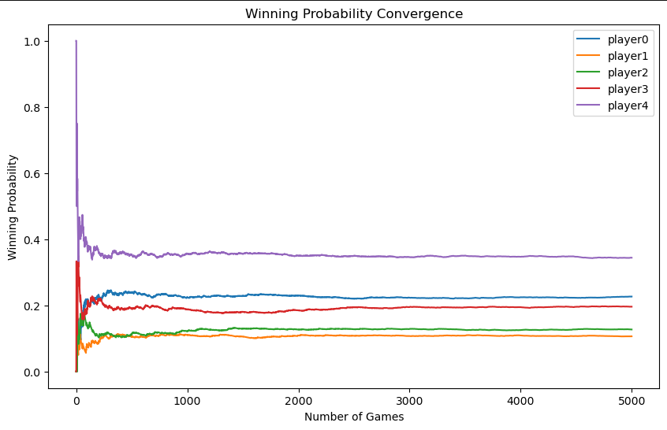
#### b. Test for randomized player order
Since the order in which players take their turns significantly impacts the win rates, we improved the player order by introducing a randomization mechanism. In this improved approach, the turn order is shuffled at the start of each game, ensuring that each round follows a different random order while keeping the first caller fixed. This approach better reveals the true pattern of the game.

As we can see from the results in the improvement method's plots, after randomizing the game order of all players while keeping player0 fixed as the first caller, the players' win rates significantly converge to around 0.2. Among them, player0 shows a slight advantage.

By randomizing the player order, we can roughly conclude that the first caller does have a certain win rate advantage, but this must be under the premise that other players are not affected by a fixed sequence.

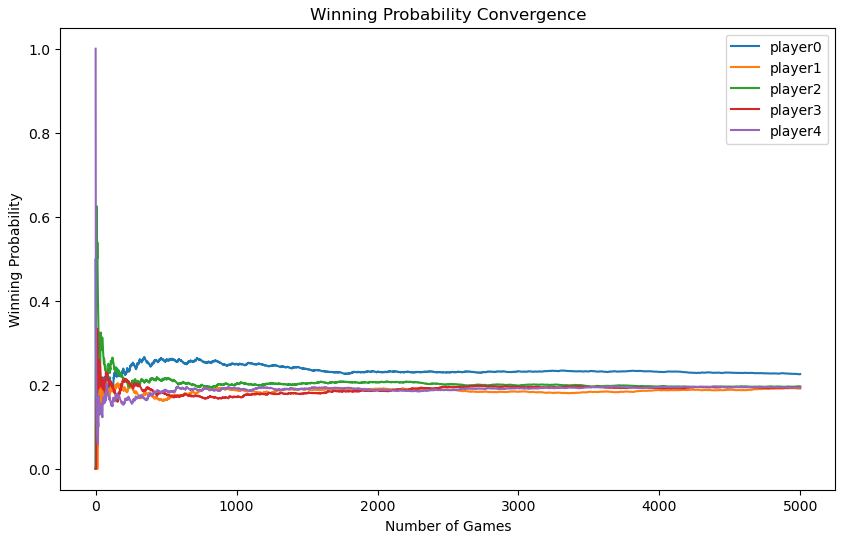

### 2. Preferred Dice Bid
#### a. Test for original player order
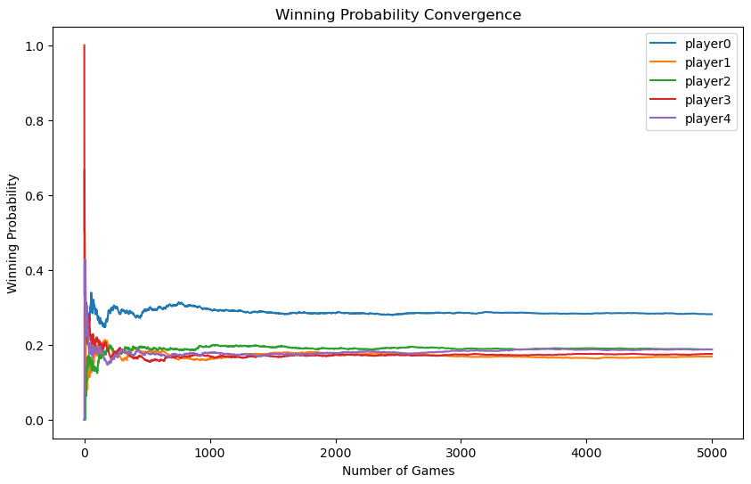
#### b. Test for randomized player order
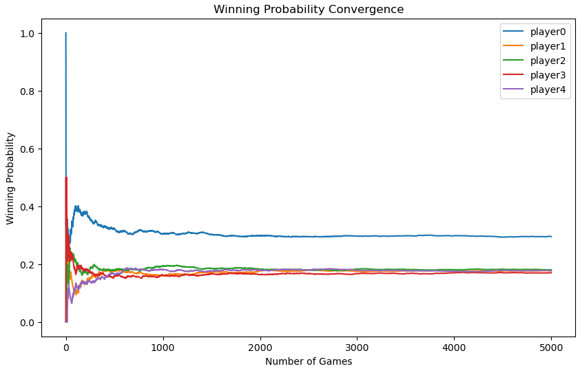

### 3. Threshold for Calling "Liar"
#### Normal Threshold: 50% of the total number of dice in play.
#### Optimal Threshold: based on a calculated probability ratio that accounts for the total dice and the player’s own dice. ( number of dice with the bid face value in own dice + 50% of the number of remaining dice)¶
We set player0 to use the normal threshold strategy and player1 to use the optimal threshold strategy.
Expected result: Players using certain thresholds to decide when to challenge have a higher win rate than players who challenge randomly.
#### a. Test for original player order

#### b. Test for randomized player order
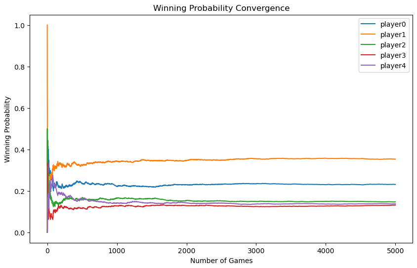
### 4. Optimal Strategy Combination
#### a. Test for original player order
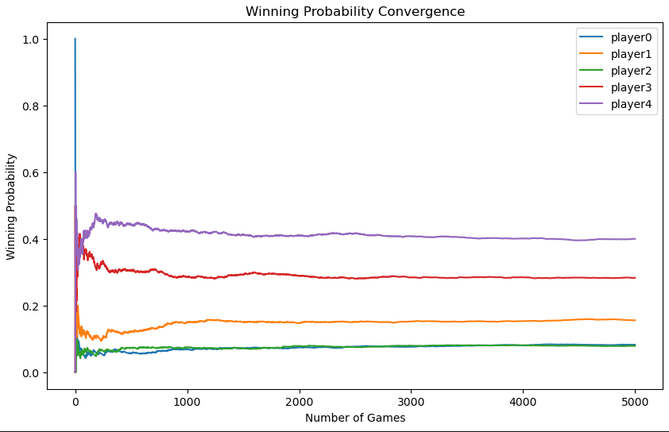
#### b. Test for randomized player order
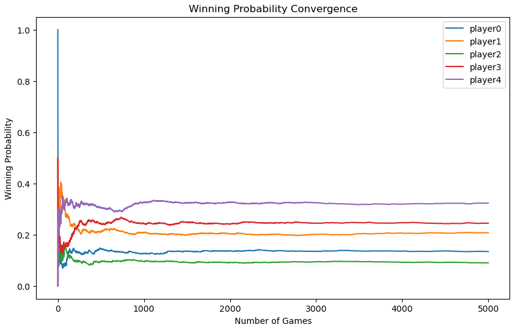
### 5. Special Rule Impact
#### a. Test for original player order
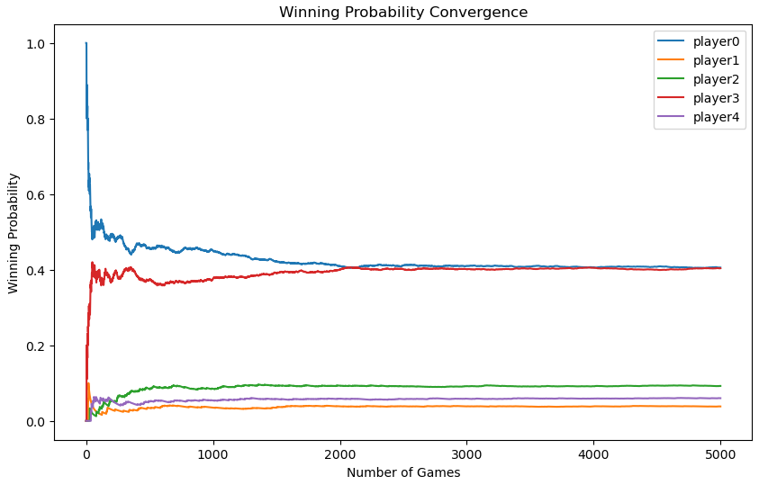
#### b. Test for randomized player order
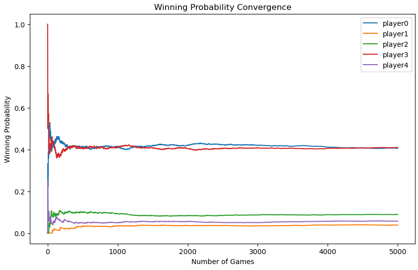

